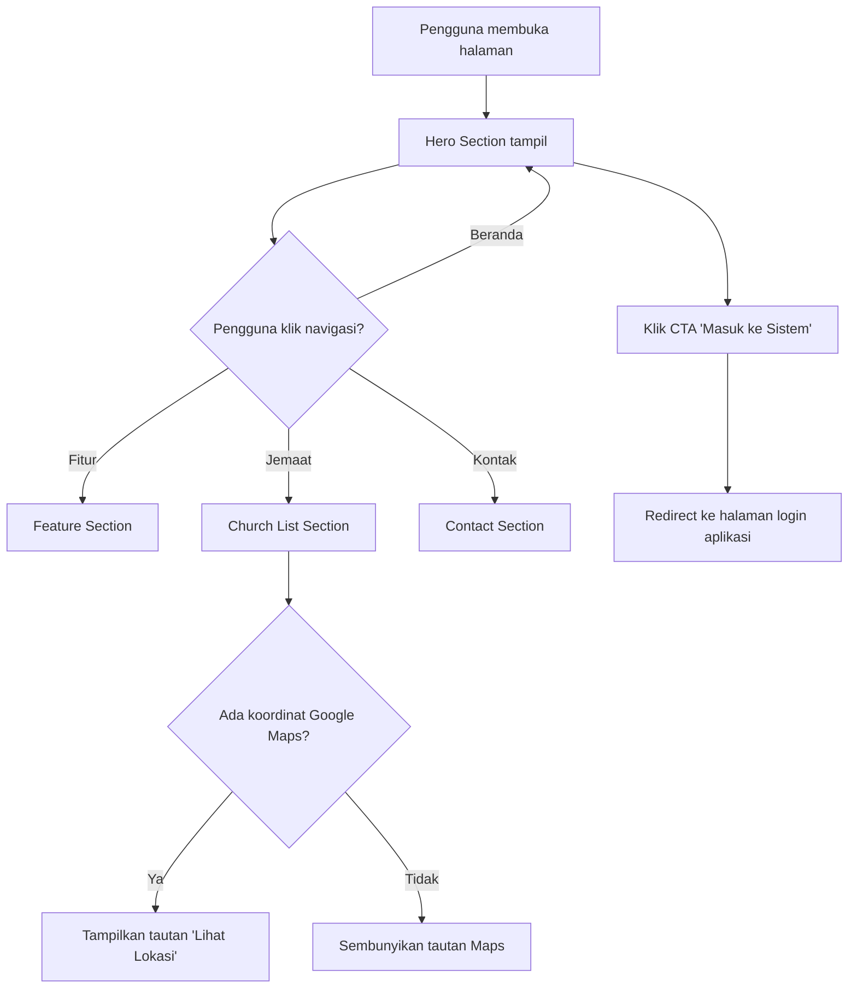

# Design Document

## Feature: gmimjadi-landing-page

---

## Overview

Landing page statis untuk Sistem Keuangan GMIM (Gereja Masehi Injili di Minahasa) yang berfungsi sebagai pintu masuk publik. Halaman ini memperkenalkan sistem kepada jemaat dan pengurus gereja, menampilkan fitur-fitur unggulan, daftar jemaat terdaftar, dan informasi kontak.

**Stack Teknologi:**

- HTML5 statis (satu file `index.html`)
- Tailwind CSS via CDN (Play CDN untuk prototyping, atau CDN stabil untuk produksi)
- Vanilla JavaScript minimal (hanya untuk hamburger menu toggle dan smooth scroll)
- Tidak ada framework JavaScript (React, Vue, dll.)

**Prinsip Desain:**

- Mobile-first: layout dirancang untuk layar kecil terlebih dahulu, kemudian diperluas untuk layar besar
- Progressive enhancement: fungsionalitas inti bekerja tanpa JavaScript
- Aksesibilitas: memenuhi standar WCAG AA

---

## Architecture

Karena ini adalah halaman HTML statis, arsitekturnya sangat sederhana:

```
index.html
├── <head>          — meta, title, Tailwind CDN, custom style minimal
├── <body>
│   ├── <nav>       — Sticky navigation bar + hamburger menu
│   ├── <main>
│   │   ├── #hero           — Hero Section
│   │   ├── #fitur          — Feature Section
│   │   ├── #jemaat         — Church List Section
│   │   └── #kontak         — Contact Section
│   └── <footer>    — Footer dengan copyright
└── <script>        — Vanilla JS untuk hamburger toggle
```

Tidak ada server-side rendering, build step, atau bundler. File dapat di-deploy langsung ke hosting statis (GitHub Pages, Netlify, Vercel, atau shared hosting biasa).

### Diagram Alur Navigasi



---

## Components and Interfaces

### 1. Navigation Bar (`<nav>`)

**Deskripsi:** Sticky navigation bar yang selalu terlihat saat scroll.

**Elemen:**

- Logo/nama "GMIM Keuangan" di sisi kiri (tautan ke `#hero`)
- Tautan navigasi desktop: "Beranda", "Fitur", "Jemaat", "Kontak"
- Tombol hamburger (`☰`) untuk mobile (tersembunyi di desktop)
- Menu dropdown vertikal untuk mobile (tersembunyi secara default)

**Behavior:**

- `position: sticky; top: 0` via Tailwind class `sticky top-0`
- Hamburger toggle menggunakan JavaScript minimal:
  ```javascript
  const btn = document.getElementById("hamburger-btn")
  const menu = document.getElementById("mobile-menu")
  btn.addEventListener("click", () => menu.classList.toggle("hidden"))
  ```
- Klik tautan navigasi menutup mobile menu secara otomatis
- Smooth scroll ke section target via CSS `scroll-behavior: smooth` pada `<html>`

**Tailwind Classes Utama:**

```
nav: sticky top-0 z-50 bg-white shadow-md
logo: text-xl font-bold text-blue-800
nav-links: hidden md:flex gap-6
hamburger: md:hidden
mobile-menu: hidden md:hidden flex-col
```

---

### 2. Hero Section (`<section id="hero">`)

**Deskripsi:** Bagian pertama yang terlihat saat halaman dimuat, berisi pesan utama dan CTA.

**Elemen:**

- Ikon/logo GMIM (SVG inline atau `` dengan alt text)
- Heading H1: "Sistem Keuangan GMIM"
- Tagline: deskripsi singkat manfaat sistem (1–2 kalimat)
- Tombol CTA: "Masuk ke Sistem" → link ke URL aplikasi

**Layout:**

- Desktop: dua kolom (teks kiri, ilustrasi kanan)
- Mobile: satu kolom vertikal (ikon → heading → tagline → CTA)

**Tailwind Classes Utama:**

```
section: min-h-screen flex items-center bg-gradient-to-br from-blue-50 to-white
container: max-w-6xl mx-auto px-4 py-16
grid: grid grid-cols-1 md:grid-cols-2 gap-8 items-center
h1: text-4xl md:text-5xl font-bold text-blue-900
tagline: text-lg text-gray-600 mt-4
cta-btn: mt-8 px-8 py-3 bg-blue-700 text-white rounded-lg hover:bg-blue-800
```

---

### 3. Feature Section (`<section id="fitur">`)

**Deskripsi:** Menampilkan minimal 4 fitur unggulan sistem dalam format kartu.

**Fitur yang Ditampilkan:**
| # | Ikon | Judul | Deskripsi |
|---|------|-------|-----------|
| 1 | 📊 | Pencatatan Keuangan | Catat pemasukan dan pengeluaran gereja secara terstruktur dan akurat. |
| 2 | 📄 | Laporan Keuangan | Buat dan unduh laporan keuangan siap cetak kapan saja. |
| 3 | 👁️ | Transparansi Jemaat | Jemaat dapat memantau kondisi keuangan gereja secara terbuka. |
| 4 | 📅 | Anggaran Program | Kelola anggaran per program dan kegiatan gereja dengan mudah. |

**Layout:**

- Desktop: grid 2×2 atau 4 kolom
- Mobile: satu kolom

**Tailwind Classes Utama:**

```
section: py-20 bg-white
grid: grid grid-cols-1 sm:grid-cols-2 lg:grid-cols-4 gap-6
card: p-6 rounded-xl border border-gray-100 shadow-sm hover:shadow-md
icon: text-4xl mb-4
title: text-lg font-semibold text-gray-800
desc: text-sm text-gray-500 mt-2
```

---

### 4. Church List Section (`<section id="jemaat">`)

**Deskripsi:** Menampilkan daftar jemaat yang telah terdaftar dalam sistem.

**Elemen:**

- Heading H2: "Jemaat yang Telah Bergabung"
- Counter: "X Jemaat Terdaftar"
- Kartu per jemaat: nama lengkap, lokasi/wilayah, tautan Google Maps (jika ada)

**Data Jemaat Awal:**

```javascript
const churches = [
  {
    name: "Jemaat EBEN HAEZER TUMPAAN I",
    location: "Tumpaan, Minahasa Selatan",
    mapsUrl: "https://maps.app.goo.gl/S1b8cguCRnvQyrLZA"
  }
]
```

**Behavior:**

- Jika `mapsUrl` ada → tampilkan tautan "Lihat Lokasi" yang membuka di tab baru (`target="_blank" rel="noopener noreferrer"`)
- Jika `mapsUrl` kosong/null → sembunyikan elemen tautan
- Counter dihitung dari panjang array data

**Layout:**

- Desktop: grid 2–3 kolom
- Mobile: satu kolom

**Tailwind Classes Utama:**

```
section: py-20 bg-gray-50
counter: text-center text-3xl font-bold text-blue-700 mb-8
grid: grid grid-cols-1 md:grid-cols-2 lg:grid-cols-3 gap-6
card: bg-white p-6 rounded-xl shadow-sm border border-gray-100
maps-link: inline-flex items-center text-blue-600 hover:underline text-sm mt-3
```

---

### 5. Contact Section (`<section id="kontak">`)

**Deskripsi:** Informasi cara menghubungi pengelola sistem.

**Elemen:**

- Heading H2: "Hubungi Kami"
- Deskripsi singkat ajakan
- Tombol/tautan WhatsApp (nomor pengelola)
- Alamat email (opsional)

**Tailwind Classes Utama:**

```
section: py-20 bg-blue-700 text-white text-center
wa-btn: inline-flex items-center gap-2 px-6 py-3 bg-green-500 rounded-lg hover:bg-green-600
```

---

### 6. Footer (`<footer>`)

**Elemen:**

- Teks copyright: "© [tahun berjalan] GMIM. Hak cipta dilindungi."
- Tautan kebijakan privasi (opsional, tersembunyi jika tidak tersedia)

**Tahun Berjalan (JavaScript):**

```javascript
document.getElementById("year").textContent = new Date().getFullYear()
```

---

## Data Models

Karena ini adalah halaman statis, tidak ada database. Data direpresentasikan sebagai objek JavaScript inline di dalam `<script>` tag atau langsung di HTML.

### Church Object

```typescript
interface Church {
  name: string // Nama lengkap jemaat
  location: string // Kota/wilayah
  mapsUrl?: string // URL Google Maps (opsional)
}
```

### Feature Object

```typescript
interface Feature {
  icon: string // Emoji atau SVG icon
  title: string // Judul fitur
  description: string // Deskripsi singkat (maks. 2 kalimat)
}
```

### Navigation Item

```typescript
interface NavItem {
  label: string // Teks tautan
  href: string // ID section target (e.g., "#fitur")
}
```

---

## Correctness Properties

_A property is a characteristic or behavior that should hold true across all valid executions of a system — essentially, a formal statement about what the system should do. Properties serve as the bridge between human-readable specifications and machine-verifiable correctness guarantees._

### Property 1: Tautan Maps hanya muncul jika data koordinat tersedia

_For any_ jemaat dalam daftar, tautan "Lihat Lokasi" SHALL ditampilkan jika dan hanya jika properti `mapsUrl` bernilai non-empty string; jika `mapsUrl` kosong atau tidak ada, elemen tautan SHALL tidak terlihat oleh pengguna.

**Validates: Requirements 3.4, 3.5, 3.6**

---

### Property 2: Counter jemaat mencerminkan jumlah data aktual

_For any_ array data jemaat dengan panjang N (N ≥ 0), teks counter yang ditampilkan di halaman SHALL menunjukkan nilai yang sama dengan N.

**Validates: Requirements 3.7**

---

### Property 3: Setiap gambar memiliki atribut alt yang deskriptif

_For any_ elemen `` dalam halaman, atribut `alt` SHALL ada dan berisi teks non-kosong yang mendeskripsikan konten gambar tersebut.

**Validates: Requirements 6.3, 6.7**

---

### Property 4: Struktur heading bersifat hierarkis

_For any_ urutan heading dalam halaman, tidak boleh ada heading level H(n+1) yang muncul tanpa didahului oleh heading level H(n) di atasnya dalam struktur dokumen (H1 → H2 → H3).

**Validates: Requirements 6.5**

---

### Property 5: Tautan navigasi mengarah ke section yang benar

_For any_ tautan navigasi dengan `href="#X"`, mengklik tautan tersebut SHALL membawa viewport ke elemen dengan `id="X"` yang ada di halaman.

**Validates: Requirements 4.3, 4.4**

---

## Error Handling

### Gambar Gagal Dimuat

- Setiap `` memiliki atribut `alt` yang deskriptif
- Untuk logo/ikon utama, gunakan SVG inline agar tidak bergantung pada request eksternal
- Untuk ilustrasi hero, sediakan fallback CSS background color jika gambar gagal

```html
<!-- Contoh: gambar dengan fallback -->

```

### Tailwind CDN Gagal Dimuat

- Sertakan minimal inline CSS untuk layout kritis (navbar, hero) sebagai fallback
- Gunakan semantic HTML yang tetap terbaca tanpa styling

### JavaScript Dinonaktifkan

- Hamburger menu: sediakan fallback dengan CSS `:focus-within` atau `<details>/<summary>` sebagai alternatif
- Smooth scroll: gunakan CSS `scroll-behavior: smooth` pada `html` tag (tidak memerlukan JS)
- Tahun copyright: hardcode tahun sebagai fallback jika JS tidak berjalan

### Data Jemaat Kosong

- Jika array `churches` kosong, Church List Section tetap ditampilkan dengan pesan "Belum ada jemaat terdaftar"
- Counter menampilkan "0 Jemaat Terdaftar"
- Tidak ada tautan Maps yang ditampilkan

---

## Testing Strategy

### Pendekatan Pengujian

Karena ini adalah halaman HTML statis, pengujian berfokus pada:

1. **Unit Tests** — Fungsi JavaScript minimal (toggle menu, render kartu jemaat, counter)
2. **Property Tests** — Validasi properti universal pada fungsi rendering
3. **Visual/Snapshot Tests** — Memastikan layout tidak berubah secara tidak sengaja
4. **Aksesibilitas** — Audit otomatis dengan axe-core atau Lighthouse

### Property-Based Testing

PBT **berlaku** untuk fitur ini karena terdapat fungsi rendering yang menerima data variabel (array jemaat, data fitur) dan menghasilkan HTML output yang harus memenuhi properti universal.

**Library yang Direkomendasikan:** [fast-check](https://github.com/dubzzz/fast-check) (JavaScript)

**Konfigurasi:** Minimum 100 iterasi per property test.

#### Property Test 1: Tautan Maps hanya muncul jika mapsUrl tersedia

```javascript
// Feature: gmimjadi-landing-page, Property 1: Tautan Maps hanya muncul jika data koordinat tersedia
fc.assert(
  fc.property(
    fc.record({
      name: fc.string({ minLength: 1 }),
      location: fc.string({ minLength: 1 }),
      mapsUrl: fc.option(fc.webUrl(), { nil: undefined })
    }),
    (church) => {
      const html = renderChurchCard(church)
      const hasLink = html.includes("Lihat Lokasi")
      return hasLink === (church.mapsUrl !== undefined && church.mapsUrl !== "")
    }
  ),
  { numRuns: 100 }
)
```

#### Property Test 2: Counter mencerminkan jumlah data aktual

```javascript
// Feature: gmimjadi-landing-page, Property 2: Counter jemaat mencerminkan jumlah data aktual
fc.assert(
  fc.property(
    fc.array(
      fc.record({
        name: fc.string({ minLength: 1 }),
        location: fc.string({ minLength: 1 })
      })
    ),
    (churches) => {
      const html = renderChurchSection(churches)
      return html.includes(`${churches.length} Jemaat Terdaftar`)
    }
  ),
  { numRuns: 100 }
)
```

#### Property Test 3: Setiap gambar memiliki atribut alt

```javascript
// Feature: gmimjadi-landing-page, Property 3: Setiap gambar memiliki atribut alt yang deskriptif
fc.assert(
  fc.property(fc.array(fc.record({ src: fc.webUrl(), alt: fc.string({ minLength: 1 }) })), (images) => {
    const html = renderPage({ images })
    const parser = new DOMParser()
    const doc = parser.parseFromString(html, "text/html")
    const imgs = doc.querySelectorAll("img")
    return Array.from(imgs).every((img) => img.alt && img.alt.trim().length > 0)
  }),
  { numRuns: 100 }
)
```

#### Property Test 4: Struktur heading hierarkis

```javascript
// Feature: gmimjadi-landing-page, Property 4: Struktur heading bersifat hierarkis
fc.assert(
  fc.property(fc.constant(renderFullPage()), (html) => {
    const parser = new DOMParser()
    const doc = parser.parseFromString(html, "text/html")
    const headings = Array.from(doc.querySelectorAll("h1,h2,h3,h4,h5,h6")).map((h) => parseInt(h.tagName[1]))
    // Tidak boleh ada lompatan level lebih dari 1
    for (let i = 1; i < headings.length; i++) {
      if (headings[i] - headings[i - 1] > 1) return false
    }
    return true
  }),
  { numRuns: 1 } // Deterministik, cukup 1 run
)
```

#### Property Test 5: Tautan navigasi mengarah ke section yang ada

```javascript
// Feature: gmimjadi-landing-page, Property 5: Tautan navigasi mengarah ke section yang benar
fc.assert(
  fc.property(fc.constant(renderFullPage()), (html) => {
    const parser = new DOMParser()
    const doc = parser.parseFromString(html, "text/html")
    const navLinks = Array.from(doc.querySelectorAll('nav a[href^="#"]'))
    return navLinks.every((link) => {
      const targetId = link.getAttribute("href").slice(1)
      return doc.getElementById(targetId) !== null
    })
  }),
  { numRuns: 1 }
)
```

### Unit Tests

- **Hamburger menu toggle**: klik tombol → menu muncul; klik lagi → menu hilang
- **Klik tautan navigasi menutup mobile menu**: setelah klik nav link, mobile menu tersembunyi
- **Tahun copyright**: `new Date().getFullYear()` menghasilkan tahun 4 digit yang benar
- **Render kartu jemaat tanpa mapsUrl**: tidak ada elemen dengan teks "Lihat Lokasi"
- **Render kartu jemaat dengan mapsUrl**: ada elemen `<a>` dengan `href` yang benar

### Aksesibilitas

- Audit dengan **Lighthouse** (target skor aksesibilitas ≥ 90)
- Audit dengan **axe-core** untuk deteksi pelanggaran WCAG AA otomatis
- Manual check: navigasi keyboard (Tab, Enter, Escape untuk menutup menu)
- Verifikasi kontras warna dengan **WebAIM Contrast Checker**

### Cross-Browser Testing

- Chrome, Firefox, Safari, Edge (versi terbaru)
- Gunakan **BrowserStack** atau pengujian manual
- Fokus pada: sticky nav, smooth scroll, hamburger menu, grid layout

### Performa

- Audit dengan **Lighthouse** (target skor performa ≥ 90)
- Verifikasi waktu muat < 3 detik pada simulasi koneksi 4G
- Pastikan tidak ada resource blocking selain Tailwind CDN
